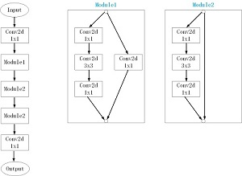

# CNNLifeGame
```sh
use cnn to simulate Game of Life.
You can star this repository to keep track of the project if it's helpful for you, thank you for your support.
```

# Introduction in Chinese
prepare

# Dependencies
- pytorch==0.4.1
- imageio
- argparse
- matplotlib

# Environment
- Ubuntu 16.04(train) / Windows10(test)
- python 3.5+(have installed the neccessary dependencies)
- Graphics: Tian XP(train) / 1050Ti(test)

# Model I used
#### baseline


# Train
#### Step1
```sh
Install the neccessary dependencies.
```
#### Step2
```sh
Modify line20-25 in train.py according to your needs.
```
#### Step3
```sh
run "python train.py"
```

# Test
```sh
Command format:
	python demo.py -m model_path"
for example:
	python demo.py -m weights/epoch_10.pkl
```

# Result
### train

### test


# More
#### WeChat Official Accounts
*Charles_pikachu*  
