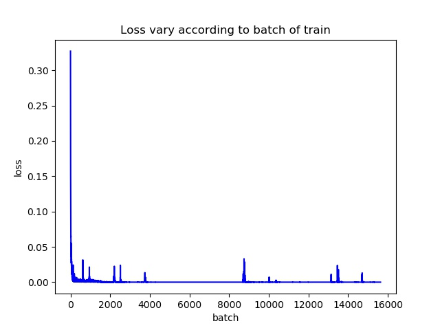

# CNNLifeGame
```sh
use cnn to simulate Game of Life.
You can star this repository to keep track of the project if it's helpful for you, thank you for your support.
```

# Preview

  


# Introduction
#### in Chinese
https://mp.weixin.qq.com/s/7_Do3TNG5tlUPE1pn-dd9w

# Environment
```
OS: Ubuntu16.04(train)/Windows10(test)
Graphics card: Tian XP(train)/1050Ti(test)
Python: Python3.5+(have installed the neccessary dependencies)
```

# Model Structure
#### baseline


# Usage
#### Train
```
Modify line20-25 in train.py according to your needs, and then run:
python train.py
```
#### Test
```
usage: demo.py [-h] [-m MODEL]

use cnn to simulate Game of Life.

optional arguments:
  -h, --help  show this help message and exit
  -m MODEL    The trained model path.
```

# Result
#### train

#### test


# More
#### WeChat Official Accounts
*Charles_pikachu*  
